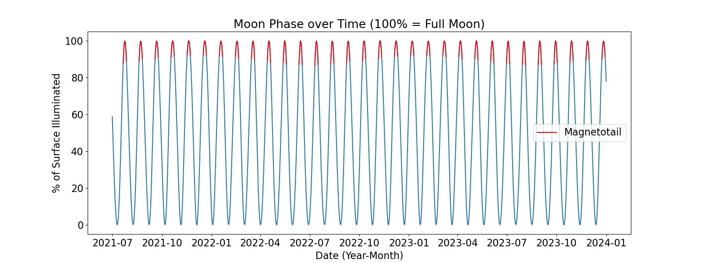

# Identifying and visualizing the moon's position with respect to the Earth's magnetotail

This work contributed in a small way to the experimental design of the [Deep Space Radiation Genomics (DSRG)](https://www.colorado.edu/faculty/zea-luis/deep-space-radiation-genomics-dsrg-artemis-1) experiment on Artemis 1. The DSRG experiment will orbit the moon, and the goal of the experiment is to expose a collection of yeast to a space radiation environment similar to that expected for a trip beyond Earth's protective magnetospheric environment. This will enable the analysis of the effect of microgravity and space radiation in genes.

To ensure the experiment encounters 'pristine' solar wind conditions, it is important to avoid data collection during the spacecraft's (and consequently, the moon's) transit through the magnetotail. The solar wind interacts with the Earth's magnetic field to form the magnetosphere, which includes a long tail that acts as a barrier to energetic particles.

<p align="center">
  
</p>

<p align="center"><font size="1">Modified from Tim Stubbs/University of Maryland/GSFC, accessed from <a href="https://www.nasa.gov/topics/moonmars/features/magnetotail_080416.html">nasa.gov</a></font></p>


This is where our team - Valerie Bernstein (myself), Kaiya Wahl, and Delores Knipp - step in as space weather researchers! Our specific goal was to predict the position of the moon with respect to the magnetotail between given start and end dates in order to provide a yes/no decision table for data collection times.

## Prerequisites (Python 3)
* [NumPy](https://numpy.org/install/)
* [Matplotlib](https://matplotlib.org/stable/users/installing.html)
* [ephem](https://pypi.org/project/ephem/)

## Run the code
1. Clone the repo
   ```sh
   git clone https://github.com/valerie-bernstein/Moon-and-Magnetotail.git
   ```
2. Run the following command in the terminal. Note that start and end dates should be in the format 'MMM D YYYY', i.e. 'Jul 1 2021'
   ```sh
   python main.py 'start date' 'end date' 
   ```

## Usage

It is important for the DSRF experiment to collect data for 3 days at a time and be conducted while in the free-flowing solar wind outside the magnetotail and bow shock. To accurately predict which times the experiment should or should not take place, the moon's position is calculated and compared to the position of the magnetotail and bow shock.

The Python astronomical ephemeris library [PyEphem](https://pypi.org/project/ephem/), developed by Rhodes, is used to calculate the moon's right ascension (RA), declination (dec), and distance from the Earth given a specified date and time. PyEphem is also used to compute the moon phase at a specified time, which is given as the percentage of the moon's surface that is illuminated. `main.py` computes the moon's RA, dec, and phase every hour between the user-specified start and end dates. `find_full_moons.py` also identifies full moon times, when the surface illumination = 100%. Below is a plot of the moon phase from 2021 to 2024, where the red highlighted areas indicate the approximate 6 day windows in which the moon passes inside the magnetotail.



To quantify the magnetotail transit times more precisely than using the 6-day window estimate, `GEItoGSE.py` coverts the PyEphem-provided lunar position in RA and dec (which are Geocentric Equatorial Inertial, or GEI, coordinates) into Geocentric Solar Ecliptic (GSE) coordinates. This coordinate conversion is performed because the magnetotail lies in the Sun-Earth ecliptic plane. The coordinate conversion is provided by [M. Hapgood (1992)](https://www.sciencedirect.com/science/article/pii/003206339290012D) and outlined below.


In the above equation, square brackets indicate matrices, *x*, *y*, and *z* indicate cartesian vector components, and *T* is the transformation matrix. *T* is defined as the matrix multiplication of two rotation matrices:


where  is a rotation by the angle  (the Sun's ecliptic longitude) about the z-axis, and  is a rotation by the angle  (the obliquity of the ecliptic) about the x-axis. These two rotations represent the rotation from Earth's equator to the ecliptic plane and the rotation in the ecliptic plane from the First Point of Aries to the Earth-Sun direction. The GSE coordinate are defined such that the +x direction is pointed from the Earth to the Sun, the +y direction is pointed towards dusk, and +z is in the northward direction out of the ecliptic plane. For further information about how to obtain the angle necessary to perform these rotations, please refer to [M. Hapgood (1992)](https://www.sciencedirect.com/science/article/pii/003206339290012D) and `GEItoGSE.py`.

Given the moon's position in GSE coordinates, `main.py` finds the intersection of the lunar orbit with the bounds of the magnetotail and bow shock is GSE coordinates. Since the moon's orbital radius is ~60 


## Acknowledgments
* Luis Zea and the entire [Deep Space Radiation Genomics (DSRG)](https://www.colorado.edu/faculty/zea-luis/deep-space-radiation-genomics-dsrg-artemis-1) team
* The Python astronomical ephemeris library [PyEphem](https://pypi.org/project/ephem/), developed by Brandon Rhodes
* Mike Hapgood, [Space Physics Coordinate Transforms: A User Guide](https://www.sciencedirect.com/science/article/pii/003206339290012D)
* Tim Stubbs (University of Maryland, Goddard Space Flight Center) for the diagram of the moon and the magnetotail, which we accessed from [nasa.gov](https://www.nasa.gov/topics/moonmars/features/magnetotail_080416.html) and futher modified